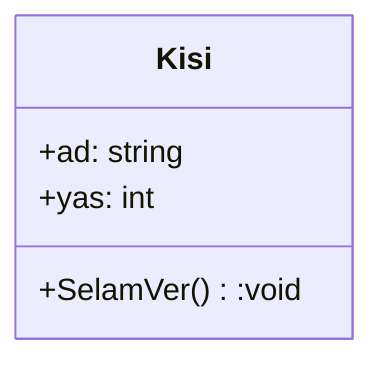

# 🧠 Hafta01 — Nesne, Sınıf ve OOP Temelleri (Teori)

Bu hafta, nesne yönelimli düşünme biçimini kavramsal olarak içselleştirmeyi hedefliyoruz. Kod yazmadan; kavramlar, terimler, analojiler ve görselleştirmelerle (UML sınıf diyagramları) ilerleyeceğiz. Amaç, “neden OOP?” sorusuna ikna edici cevaplar üretebilmek ve “sınıf–nesne” ayrımını zihnimizde netleştirmektir.

## 🎯 Öğrenme Hedefleri
- 🧱 Sınıf (class) ve 🔷 nesne (object) kavramlarını birbirinden ayırabilmek.
- 🧩 OOP’nin motivasyonu, faydaları ve kullanım alanlarını açıklayabilmek.
- 🗂️ UML sınıf diyagramının temel notasyonunu okuyup yorumlayabilmek.

## 📌 Tanımlar ve Temel Kavramlar
- 🧱 Sınıf (Class): Bir kavramın “şablonu/kalıbıdır”. İçinde o kavramın hangi niteliklere (veri) ve davranışlara (işlemler/metotlar) sahip olacağı tanımlanır. Sınıf; tasarım zamanı bir tanım olarak var olur ve çok sayıda nesnenin üretilmesine olanak tanır.
- 🔷 Nesne (Object): Sınıftan üretilen çalışma zamanı örneğidir. Kendine özgü durumu (nitelik değerleri) ve kimliği (referansı) vardır. Aynı sınıftan türetilmiş iki nesne, farklı durumlar taşıyabilir.
- 🎛️ Özellik/Nitelik (Attribute/Property): Bir nesnenin verisel durumunu temsil eder (örneğin “ad”, “yaş”).
- ⚙️ Davranış/İşlem (Operation/Method): Nesnenin gerçekleştirdiği eylem ya da sunduğu işlevdir (örneğin “SelamVer()”).
- 🧭 Modelleme: Gerçek dünyayı yazılım dünyasına aktarırken, önemli ayrıntıları seçip uygun soyutlamalarla temsil etme işidir.

## 🧩 Nesne ve Sınıf — Farklar
- Rol: Sınıf, tasarım zamanı bir şablon; nesne, çalışma zamanı bir örnektir.
- Yaşam Döngüsü: Sınıf kodda tanımlıdır; nesne bellekte yaşar.
- Kimlik: Nesnelerin kimliği/referansı vardır; sınıfların yoktur.
- Çokluk: Tek bir sınıftan çok sayıda nesne üretilebilir ve her nesne ayrı bir durumu temsil eder.
- Değişebilirlik: Nesnenin durumu zamanla değişebilir; sınıf tanımı ise genellikle sabittir (tasarım değişmedikçe).

## 🧱↔️🔷 Günlük Hayat Analojileri
- Plan–Bina: Mimarî plan (sınıf), inşa edilen bina (nesne).
- Tarif–Yemek: Yemek tarifi (sınıf), pişirdiğiniz yemek (nesne).
- Kalıp–Kurabiye: Kalıp (sınıf), kesilen kurabiye (nesne).

Bu analojiler, “sınıf = tanım/şablon, nesne = somut örnek” fikrini pekiştirir.

## 🧯 OOP’nin Amacı ve Faydaları
- 🧩 Karmaşıklık Yönetimi: Sistemi anlamlı parçalara (nesnelere) bölerek anlaşılabilir, bakımı kolay bir yapı kurar.
- ♻️ Yeniden Kullanılabilirlik: İyi modellenmiş sınıflar farklı projelerde de kullanılabilir.
- 🧪 Test Edilebilirlik: Sınırları belirli nesneler ve arayüzler, birimleri izole test etmeyi kolaylaştırır.
- 🔧 Değişime Uyum: Nesneler arası ilişkiler doğru kurulduğunda yeni özellikler eklemek veya davranışı değiştirmek daha az maliyetlidir.

## 🧱 OOP’nin Temel Özellikleri (Tanımsal)
- 🔒 Kapsülleme (Encapsulation): Veriyi ve o veriyi yöneten davranışları bir arada tutup dış dünyaya kontrollü bir arayüz sunar. Gereksiz iç ayrıntılar gizlenerek tutarlılık korunur.
- 🧭 Soyutlama (Abstraction): Önemli olana odaklanma, gereksiz ayrıntıları gizleme yaklaşımıdır. Model daha sade ve amaca uygundur.
- 🧬 Kalıtım (Inheritance): Ortak özellik ve davranışları üst bir yapı altında toplayıp alt yapılara devretmektir (is-a ilişki mantığı). Kod tekrarını azaltır.
- 🌀 Çok Biçimlilik (Polymorphism): Aynı arayüz veya işlem çağrısının, farklı türler tarafından farklı biçimde uygulanabilmesidir. Genişletilebilir ve esnek tasarımlara kapı açar.

## 📐 UML Sınıf Diyagramı (Giriş)
UML, modelinizi standart bir görsel dil ile ifade etmenizi sağlar. Sınıf diyagramı, statik yapıyı (sınıflar, nitelikler, metotlar) ve aralarındaki ilişkileri gösterir.

- Görünürlük Notasyonu: `+ public`, `- private`, `# protected`
- İlişkiler:
  - Generalization (kalıtım): A <|-- B
  - Realization (arayüz gerçekleştirme): I <|.. C
  - Association (ilişki): A --> B
  - Aggregation (zayıf sahiplik): A o-- B
  - Composition (güçlü sahiplik): A *-- B

### 🧭 Mini Örnek (Sınıf Yapısı)

## 📝 Alıştırmalar
1) “Kitap, Yazar, Yayinevi” kavramlarını 2–3 nitelik ve 1 davranışla modelleyin.
2) “Sınıf–Nesne” ayrımını iki yeni benzetme ile açıklayın (ör. “Tarif–Yemek”, “Plan–Bina”).
3) Kısa bir paragrafta kapsülleme ve soyutlama arasındaki farkı anlatın.

## 📚 Önerilen Okuma
- OOP kavramları — kavramsal giriş:  
  https://learn.microsoft.com/dotnet/csharp/fundamentals/object-oriented/
- UML sınıf diyagramlarına giriş:  
  https://www.uml-diagrams.org/class-diagrams-overview.html

---
