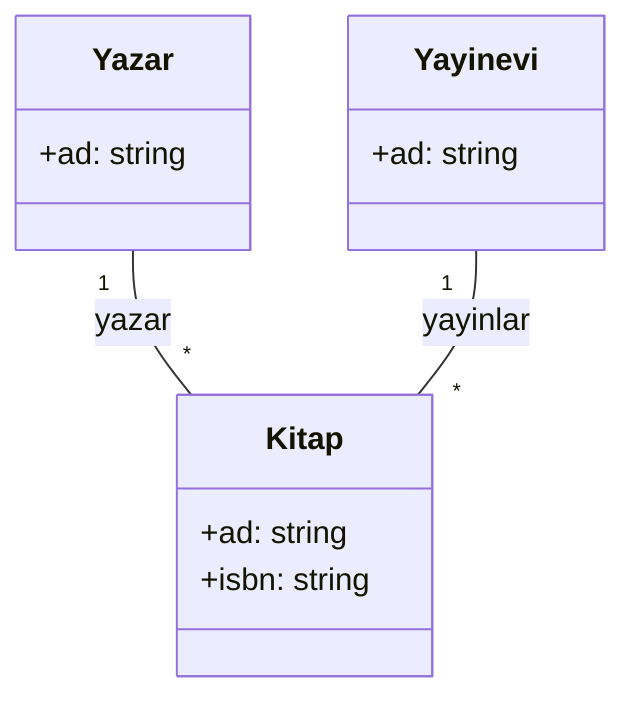
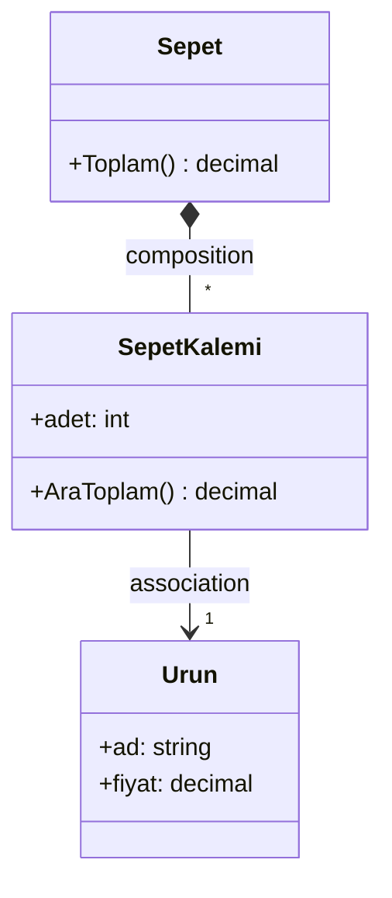
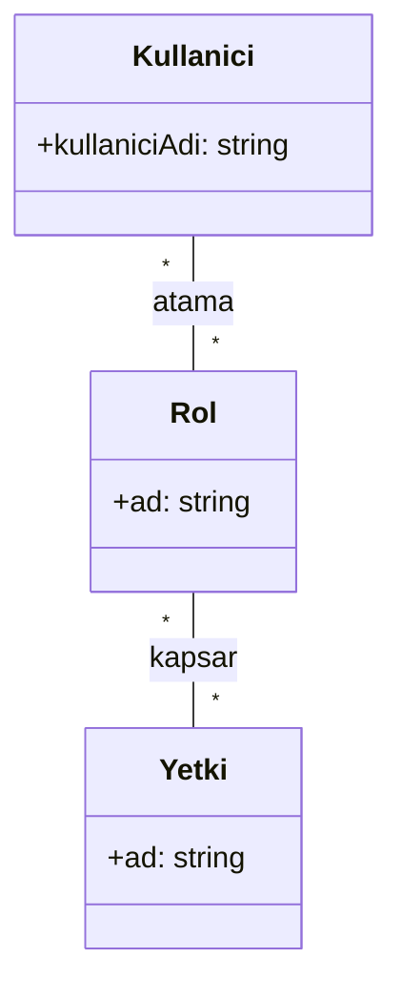

# 🗂️ Hafta02 — UML Nedir? Neden Sınıf Diyagramı? (Teori + Görsel)

Bu hafta, UML’nin (Unified Modeling Language) amacını, kapsamını ve özellikle sınıf diyagramının neden güçlü bir iletişim aracı olduğunu ele alıyoruz. Kod ayrıntılarına girmeden; notasyon, ilişki türleri, çokluk (multiplicity) ve yönlülük (navigability) gibi temel kavramları sistematik biçimde işliyoruz.

## 🎯 Öğrenme Hedefleri
- UML’nin yazılım geliştirme sürecindeki rolünü ve faydalarını açıklayabilmek.
- Sınıf diyagramının bileşenlerini (sınıf, nitelik, operasyon) doğru notasyonla ifade edebilmek.
- İlişkileri (association, aggregation, composition, generalization, realization) doğru seçip görselleştirebilmek.

## ❓ UML Nedir?
- UML, yazılım sistemlerini standart ve görsel bir dille modellemek için kullanılan bir notasyon setidir.
- Hem yapısal diyagramları (Class, Object, Package, Component) hem davranışsal diyagramları (Sequence, Activity, State, Use Case) kapsar.
- Amaç, ekip üyeleri arasında ortak bir dil oluşturarak analiz–tasarım–dokümantasyon süreçlerini hızlandırmaktır.

## 🎯 Neden UML Sınıf Diyagramı?
- 🧭 Alan modelinizi netleştirir: Sınıflar, nitelikler ve işlemler tek bir resimde görünür.
- 🔗 İlişkileri görünür kılar: İki sınıf arasındaki bağın türü ve çokluğu (1, 0..1, *, 1..*) belirtilir.
- 🤝 Ortak dil: Geliştirici, analist, test mühendisi ve paydaşların aynı görsele bakıp aynı şeyleri anlamasını sağlar.
- 🧪 Hata yakalama: Yanlış tasarım kararları, kod yazılmadan önce diyagramda fark edilebilir.
- 🧱 İzlenebilirlik: Gereksinim → analiz modeli → tasarım modeli → kod ilişkileri daha şeffaf olur.

## 🧭 Temel Notasyon ve İlişkiler
- Görünürlük: `+ public`, `- private`, `# protected`
- İlişki türleri:
  - 🔗 Association: Sınıflar arası genel ilişki (ör. “Öğrenci ders alır”).
  - ◇ Aggregation (zayıf sahiplik): Bütün–parça ilişkisi; parça bağımsız yaşayabilir (ör. “Ekip — Üye”).
  - ◆ Composition (güçlü sahiplik): Parça bütünün yaşam döngüsüne bağlıdır (ör. “Sipariş — SiparişKalemi”).
  - 🔺 Generalization (kalıtım): Üst–alt sınıf hiyerarşisi (is-a ilişkisi).
  - 🔻 Realization (arayüz gerçekleştirme): Bir arayüzün somut sınıflarca uygulanması.
- Navigability (yönlülük): İlişkinin hangi yönde erişim/bağımlılık içerdiğini belirtir; diyagram okunabilirliğini artırır.
- Multiplicity (çokluk): 1, 0..1, *, 1..* gibi notasyonlarla tarafların kaç örnek üzerinden ilişki kurduğunu gösterir.

## 📐 Örnek A — Kütüphane Modeli
Bu model, “Yazar” ve “Yayınevi”nin çok sayıda “Kitap” ile ilişkisini ortaya koyar.

- Not: Burada association kullanılmıştır; bir kitap yalnızca bir yayıneviyle ilişkilendirilebilir varsayımı sistem kurallarınıza göre değişebilir.

## 📐 Örnek B — Sepet, SepetKalemi, Urun (Composition)
“SepetKalemi” varlığının yaşamı genellikle “Sepet”e bağlıdır; bu nedenle composition uygundur.

- Gerekçe: Sepet silindiğinde “SepetKalemi” de anlamını yitirir; bu güçlü sahiplik bağıdır.

## 📐 Örnek C — Roller ve Yetkiler (Çoktan Çoğa)
Kullanıcıların birden fazla role sahip olabildiği, rollerin de birden fazla kullanıcıya atanabildiği senaryolarda çoktan–çoğa ilişkiler ortaya çıkar.

- Not: Gerçek sistemlerde bu çoktan–çoğa ilişkiler genellikle ilişki (köprü) sınıflarıyla (örn. KullaniciRol) normalize edilir.

## 🧯 Aggregation vs Composition — Seçim Ölçütleri
- Parça bağımsız var olabilir mi? Evetse aggregation, hayırsa composition.
- Yaşam döngüsü kime bağlı? Parça, bütün olmadan anlamsızsa composition.
- Sahiplik derecesi nedir? Zayıf sahiplik aggregation, güçlü sahiplik composition.

## 📝 Alıştırmalar
1) “Restoran–Masa–Sipariş” için sınıf diyagramı çizin; hangi ilişkinin aggregation, hangisinin composition olduğuna gerekçe yazın.
2) “Kullanıcı–Rol–Yetki” modelini bir “KullaniciRol” köprü sınıfıyla genişletin ve diyagramlayın.
3) Bir projede navigability’nin (ok yönü) okunabilirliğe katkısını örnekle açıklayın.

## 📚 Önerilen Okuma
- UML ilişkileri: https://www.uml-diagrams.org/class-diagrams-relationships.html
- Sınıf diyagramı notasyonu: https://www.uml-diagrams.org/class-diagrams-overview.html

---
