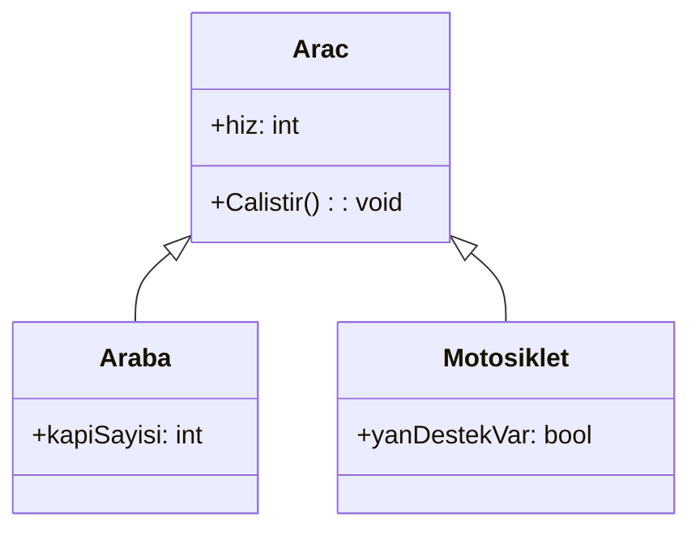
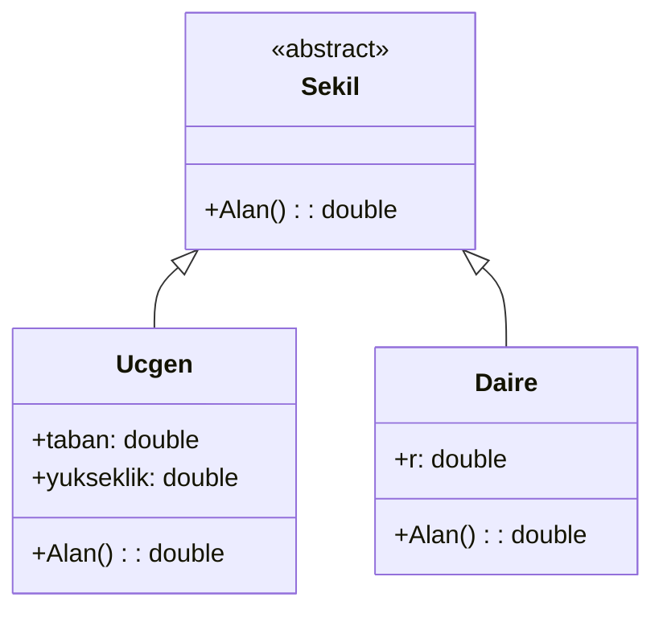
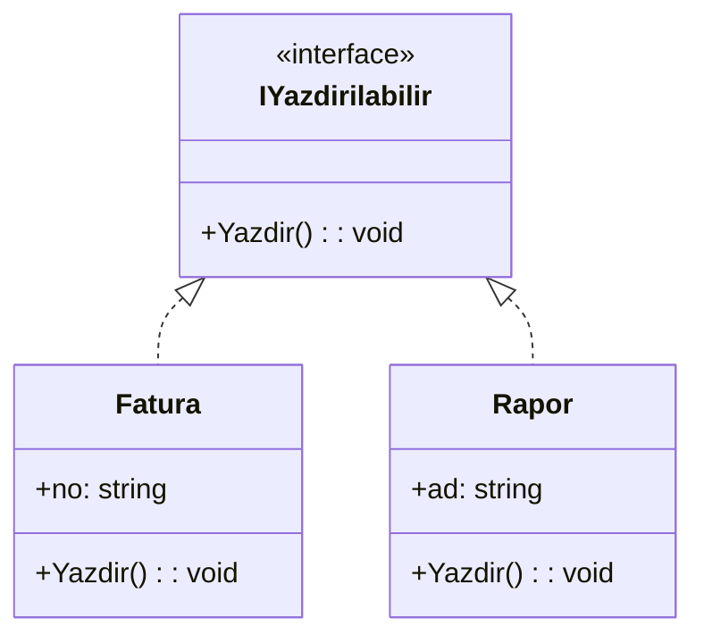

# 🧬 Hafta03 — Kalıtım, Çok Biçimlilik (Teori) ve UML Generalization/Realization

Üçüncü haftada OOP’nin davranış odaklı temel ilkelerini teorik düzeyde ele alıyoruz. Özellikle “kalıtım” (generalization) ve “çok biçimlilik” (polymorphism) kavramlarının neden ve nasıl kullanılması gerektiğini, arayüz (interface) sözleşmeleriyle birlikte UML üzerinde ifade edeceğiz. Bu haftada da kod ayrıntısına girmeden, kavramsal doğruluğa ve görselleştirmeye odaklanıyoruz.

## 🎯 Öğrenme Hedefleri
- 🔺 Kalıtımın (generalization) doğru kullanım alanlarını ve sınırlarını kavramak.
- 🌀 Çok biçimliliğin (polymorphism) esneklik ve genişletilebilirlik sağlama biçimlerini anlamak.
- 🔻 Arayüz gerçekleştirme (realization) ilişkisini UML ile doğru ifade edebilmek.

## 🧬 Kalıtım (Generalization) — Ne Zaman?
- Paylaşılan özellik ve davranışları üst bir sınıfta toplamak istediğinizde uygundur.
- “is-a” testi: Alt tür gerçekten üst türün özel bir hali mi? Bu soru dürüstçe “evet”se kalıtım uygundur.
- Aşırı kalıtım kokuları: Sırf kod paylaşmak için kalıtım kullanmak; uygun değilse bileşim (has-a) tercih edilmelidir.
- Yararları: Kod tekrarını düşürür, ortak sözleşme sunar.
- Riskleri: Yanlış hiyerarşi, kırılgan temeller ve zor anlaşılan bağımlılıklar oluşturabilir.

### 📐 Örnek — Taşıt Hiyerarşisi

Bu diyagramda “Araba” ve “Motosiklet”, “Arac”ın özel örnekleridir. Ortak davranış (örn. çalıştırma) üst sınıfta, özgün nitelikler alt sınıflardadır.

## 🌀 Çok Biçimlilik (Polymorphism) — Neden Gerekli?
- Aynı işlem çağrısının (örn. “Alan()”) farklı türlerde farklı sonuçlar üretmesine olanak tanır.
- Yeni varyantlar eklendiğinde mevcut kodu en az etkiyle genişletebilmek için kullanılır.
- Bağımlılıkların soyutlamalara (üst sınıf/arayüz) bağlanmasını teşvik eder, böylece modüller arası bağımlılık zayıflar.

### 📐 Örnek — Şekiller ve Alan Hesabı

Burada “Sekil” soyut bir üst sınıf olarak ortak bir sözleşme sağlar. “Ucgen” ve “Daire” bu sözleşmeyi farklı biçimlerde hayata geçirir. İstemci kod, “Sekil” üzerinden konuşur; somut türün ayrıntısına bağımlı değildir.

## 🔻 Arayüz (Interface) ve Realization
- Arayüzler “ne yapılacağı”nı söyler, “nasıl yapılacağı”nı değil.
- Birden fazla sınıf aynı arayüzü farklı yaklaşımlarla gerçekleştirebilir; bu da sistemde strateji değişimini kolaylaştırır.
- Arayüzler, istemci kod ile hizmet sağlayıcılar arasına açık bir sözleşme koyar.

### 📐 Örnek — Yazdırılabilir Varlıklar

Aynı arayüz farklı sınıflarca farklı biçimde uygulanabilir. İstemci, “IYazdirilabilir” üzerinden çalışarak somut sınıflara bağımlılığını azaltır.

## 🧭 İlkeler ve İpuçları (Kavramsal)
- LSP (Liskov Substitution Principle): Alt tür, üst türün beklenen davranışlarını bozmayacak şekilde onun yerine geçebilmelidir. Bu, kalıtımın güvenli kullanılmasının temel ölçütüdür.
- ISP (Interface Segregation Principle): Arayüzler küçük, odaklı ve amaca uygun olmalıdır. “Şişkin” arayüzler, istemcileri gereksiz metotları uygulamaya zorlar.
- DIP (Dependency Inversion Principle): Yüksek seviye modüller, düşük seviye detaylara değil, soyutlamalara bağımlı olmalıdır. Bu, bağımlılıkların gevşek bağlanmasını sağlar.
- Bileşim Tercihi: Kod paylaşımı için kalıtım yerine önce bileşim (has-a) düşünün. Kalıtım, davranışsal uzmanlaşma için uygundur; sadece ortak kodu “kolayca kopyalamamak” adına seçilmemelidir.

## 📝 Alıştırmalar
1) “Ödeme” (soyut üst sınıf) → “KrediKartı/Havale/Nakit” (alt sınıflar) hiyerarşisini generalization ile çizin; her alt sınıfın neden üst sınıf yerine geçebildiğini LSP açısından tartışın.
2) “ILoglayici” arayüzünü ve “KonsolLog/DosyaLog” gibi iki farklı gerçekleştirmeyi realization ile gösterin; strateji değiştirme senaryosu yazın (ne zaman hangisini seçersiniz?).
3) Mevcut bir sisteminizde (okul, kütüphane, e-ticaret vb.) kalıtım mı yoksa bileşim mi daha doğru? Bir örnekle gerekçe yazın.

## 📚 Önerilen Okuma
- Generalization ve Realization: https://www.uml-diagrams.org/generalization.html  
- Arayüzler ve sözleşmeler: https://www.uml-diagrams.org/class-diagrams-interfaces.html

---