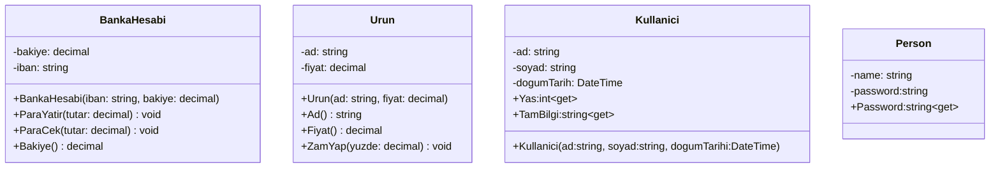

# 🔒 Hafta03 — Kapsülleme (Encapsulation) — UML + Teori + 6 C# Örneği

Kapsülleme; veriyi (durum) ve o veriyi yöneten davranışları (operasyonlar) tek bir sınıfta bir araya getirerek dış dünyaya yalnızca gerekli olan arayüzü sunmayı amaçlar. Böylece sınıfın iç tutarlılığı (invariants) korunur, yan etkiler azaltılır ve değişikliklerin sınıfın dışına sızması engellenir. Doğru kapsülleme, “nesne her an geçerli durumda kalmalıdır” ilkesini benimser: kurucularda ve değiştirici metotlarda doğrulama (guard clauses), tutarlı hata mesajları ve mümkünse değişmez (immutable) değer nesneleri kullanılır. Koleksiyonlar doğrudan dışarı açılmaz; salt-okunur(ReadOnly) görünümler  sunulur ve öğe ekleme/çıkarma kontrollü metotlarla yapılır. Bu yaklaşım test edilebilirliği, bakım kolaylığını ve genişletilebilirliği artırır.

Kapsüllemeyi uygularken bazı iyi pratikler: (1) Alanları private tutun; dışarıya property veya metotlarla kontrollü erişim verin. (2) Nesnenin tüm geçerlilik kurallarını tek yerde konsolide edin (örneğin Email gibi değer nesneleriyle). (3) Koleksiyon kapsülleme uygulayın; liste referansını dışarı döndürmek yerine salt-okunur görünüm verin ve sınıf içinden ekleyip silin. (4) Küçük, tek sorumluluğa sahip sınıflar tercih edin; sınıfın amacı net olmalı. (5) Durum değişikliklerinde geçersiz durumları erken yakalayın; “fail fast” yaklaşımıyla hata kaynağını çabuk tespit edin.

Aşağıda önce UML diyagramı, ardından kapsüllemeyi gösteren optimize C# örnekleri yer alır.

## UML — Temel Kapsülleme Senaryoları


## 6 Adet Kapsülleme C# Örneği (Optimize)
Örnek 1 — BankaHesabi: Bakiye Kapsülleme
```csharp
namespace Kapsulleme01
{
    public class BankaHesabi
    {
        //-bakiye:decimal
        private decimal bakiye;

        //+iban:string
        private string iban;

        //+BankaHesabi(iban:string, bakiye:decimal)
        public BankaHesabi(string iban, decimal bakiye)
        {
     
            this.iban = string.IsNullOrWhiteSpace(iban) ? iban : "Geçersiz IBAN";
            this.bakiye = (bakiye>=0)? bakiye:0;

        }

        public void ParaYatir(decimal tutar)
        {
            if (tutar<0)
            {
                Console.WriteLine("Lütfen geçerli bir tutar giriniz.");
            }
            else
            {
                bakiye += tutar;
            }
        }

        public void ParaCek(decimal tutar) {
            if (tutar<0)
            {
                Console.WriteLine("Girilen tutar negatif olamaz");
            }else if (tutar > bakiye)
            {
                Console.WriteLine("Yetersiz bakiye !");
            }
            else
            {
                bakiye -= tutar;
            }
        }

        public decimal Bakiye()
        {
            return bakiye;
        }

    }
}
```

Örnek 2 — Ürün: Doğrulama ve Yuvarlama
```csharp
public class Urun
{
    private string ad;
    private decimal fiyat;

    public Urun(string ad, decimal fiyat)
    {
        this.ad = ad;
        this.fiyat = fiyat;
    }

    public string Ad() => ad;
    public decimal Fiyat() => fiyat;

    public void ZamYap(decimal yuzde)
    {
        if (yuzde <= 0)
        {
            Console.WriteLine("Zam yapma oranı negatif olamaz");
        }
        else
        {
            fiyat +=fiyat*yuzde/100;
        }          
    }
}
```

Örnek 3 — Kullanici: Değer Nesnesi ile Kapsülleme
```csharp
 public class Kullanici
 {
     private string ad;
     private string soyad;
     private DateTime dogumTarihi;

     public int Yas
     {
         get
         {
             return DateTime.Now.Year-dogumTarihi.Year;
         }
     }
     public string TamBilgi
     {
         get
         {
             return $"Ad:{ad}\nSoyad:{soyad}\nYaş:{Yas}";
         }
     }
     
     public Kullanici(string ad, string soyad, DateTime dogumTarihi)
     {
         this.ad = ad;
         this.soyad = soyad;
         this.dogumTarihi = dogumTarihi;
     }
 }
```

Örnek 4 — Person: Kapsülleme
```csharp
 public class Person
 {
     private string name; // field
     private string password;

     public string Name   // property
     {
         get { return name; }   // get method
         set
         {

             name = value;// set method
         }
     }

     public string Password
     {
         get { return password; }
         set
         {
             if (value=="123")
             {
                 Console.WriteLine("Tebrikler! Giriş Yaptınız");
                 password = value;
             }
             else
             {
                 Console.WriteLine("Şifreniz hatalı");
             }
         }
     }
 }
```