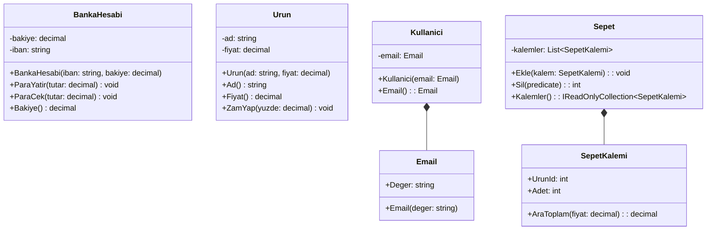

# 🔒 Hafta04 — Kapsülleme (Encapsulation) — UML + Teori + 6 C# Örneği

Bu hafta kapsülleme (encapsulation) üzerinde duruyoruz. Kapsülleme; veriyi (durum) ve o veriyi yöneten davranışları (operasyonlar) tek bir sınıfta bir araya getirerek dış dünyaya yalnızca gerekli olan arayüzü sunmayı amaçlar. Böylece sınıfın iç tutarlılığı (invariants) korunur, yan etkiler azaltılır ve değişikliklerin sınıfın dışına sızması engellenir. Doğru kapsülleme, “nesne her an geçerli durumda kalmalıdır” ilkesini benimser: kurucularda ve değiştirici metotlarda doğrulama (guard clauses), tutarlı hata mesajları ve mümkünse değişmez (immutable) değer nesneleri kullanılır. Koleksiyonlar doğrudan dışarı açılmaz; salt-okunur görünümler (IReadOnlyCollection) sunulur ve öğe ekleme/çıkarma kontrollü metotlarla yapılır. Bu yaklaşım test edilebilirliği, bakım kolaylığını ve genişletilebilirliği artırır.

Kapsüllemeyi uygularken bazı iyi pratikler: (1) Alanları private tutun; dışarıya property veya metotlarla kontrollü erişim verin. (2) Nesnenin tüm geçerlilik kurallarını tek yerde konsolide edin (örneğin Email gibi değer nesneleriyle). (3) Koleksiyon kapsülleme uygulayın; liste referansını dışarı döndürmek yerine salt-okunur görünüm verin ve sınıf içinden ekleyip silin. (4) Küçük, tek sorumluluğa sahip sınıflar tercih edin; sınıfın amacı net olmalı. (5) Durum değişikliklerinde geçersiz durumları erken yakalayın; “fail fast” yaklaşımıyla hata kaynağını çabuk tespit edin.

Aşağıda önce UML diyagramı, ardından kapsüllemeyi gösteren optimize C# örnekleri yer alır.

## UML — Temel Kapsülleme Senaryoları


## 6 Adet Kapsülleme C# Örneği (Optimize)
Örnek 1 — BankaHesabi: Bakiye Kapsülleme
```csharp
namespace Kapsulleme01
{
    public class BankaHesabi
    {
        //-bakiye:decimal
        private decimal bakiye;

        //+iban:string
        private string iban;

        //+BankaHesabi(iban:string, bakiye:decimal)
        public BankaHesabi(string iban, decimal bakiye)
        {
     
            this.iban = string.IsNullOrWhiteSpace(iban) ? iban : "Geçersiz IBAN";
            this.bakiye = (bakiye>=0)? bakiye:0;

        }

        public void ParaYatir(decimal tutar)
        {
            if (tutar<0)
            {
                Console.WriteLine("Lütfen geçerli bir tutar giriniz.");
            }
            else
            {
                bakiye += tutar;
            }
        }

        public void ParaCek(decimal tutar) {
            if (tutar<0)
            {
                Console.WriteLine("Girilen tutar negatif olamaz");
            }else if (tutar > bakiye)
            {
                Console.WriteLine("Yetersiz bakiye !");
            }
            else
            {
                bakiye -= tutar;
            }
        }

        public decimal Bakiye()
        {
            return bakiye;
        }

    }
}
```

Örnek 2 — Ürün: Doğrulama ve Yuvarlama
```csharp
public class Urun
{
    private string _ad;
    private decimal _fiyat;

    public Urun(string ad, decimal fiyat)
    {
        _ad = string.IsNullOrWhiteSpace(ad) ? throw new ArgumentException("Ad boş") : ad.Trim();
        _fiyat = fiyat >= 0 ? decimal.Round(fiyat, 2) : throw new ArgumentOutOfRangeException(nameof(fiyat));
    }

    public string Ad() => _ad;
    public decimal Fiyat() => _fiyat;

    public void ZamYap(decimal yuzde)
    {
        if (yuzde <= 0) throw new ArgumentOutOfRangeException(nameof(yuzde));
        _fiyat = decimal.Round(_fiyat * (1 + yuzde / 100m), 2);
    }
}
```

Örnek 3 — Email Değer Nesnesi
```csharp
public class Email
{
    public string Deger { get; }
    public Email(string deger)
    {
        if (string.IsNullOrWhiteSpace(deger)) throw new ArgumentException("E-posta boş");
        var s = deger.Trim();
        if (!s.Contains("@") || s.StartsWith("@") || s.EndsWith("@")) throw new ArgumentException("Geçersiz e-posta");
        Deger = s;
    }
    public override string ToString() => Deger;
}
```

Örnek 4 — Kullanici: Değer Nesnesi ile Kapsülleme
```csharp
public class Kullanici
{
    private Email _email;
    public Kullanici(Email email) => _email = email ?? throw new ArgumentNullException(nameof(email));
    public Email Email() => _email;
    public void EmailGuncelle(Email yeni) => _email = yeni ?? throw new ArgumentNullException(nameof(yeni));
}
```

Örnek 5 — Sepet: Koleksiyon Kapsülleme
```csharp
public class SepetKalemi
{
    public int UrunId { get; }
    public int Adet { get; }
    public SepetKalemi(int urunId, int adet)
    {
        if (urunId <= 0) throw new ArgumentOutOfRangeException(nameof(urunId));
        if (adet <= 0) throw new ArgumentOutOfRangeException(nameof(adet));
        UrunId = urunId; Adet = adet;
    }
    public decimal AraToplam(decimal fiyat) => decimal.Round(fiyat * Adet, 2);
}

public class Sepet
{
    private readonly List<SepetKalemi> _kalemler = new();
    public void Ekle(SepetKalemi kalem) => _kalemler.Add(kalem ?? throw new ArgumentNullException(nameof(kalem)));
    public int Sil(Func<SepetKalemi, bool> p) => _kalemler.RemoveAll(k => p(k));
    public IReadOnlyCollection<SepetKalemi> Kalemler() => _kalemler.AsReadOnly();
}
```

Örnek 6 — Kisi: Doğrulama + Salt-Okunur Telefonlar
```csharp
public class Kisi
{
    private string _ad;
    private readonly List<string> _telefonlar = new();
    public Kisi(string ad) => _ad = string.IsNullOrWhiteSpace(ad) ? throw new ArgumentException("Ad boş") : ad.Trim();
    public string Ad() => _ad;
    public void AdGuncelle(string ad) => _ad = string.IsNullOrWhiteSpace(ad) ? throw new ArgumentException("Ad boş") : ad.Trim();
    public void TelefonEkle(string tel)
    {
        if (string.IsNullOrWhiteSpace(tel)) throw new ArgumentException("Tel boş");
        _telefonlar.Add(tel.Trim());
    }
    public IReadOnlyList<string> Telefonlar() => _telefonlar.AsReadOnly();
}
```